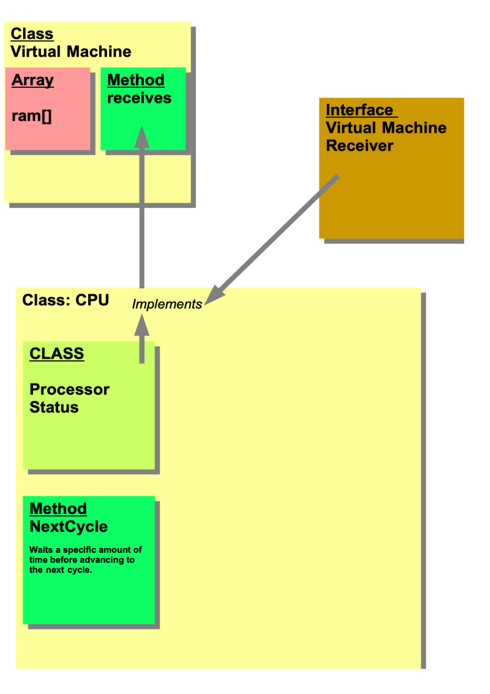

Just another 6502 emulator
--------------------------
"You can never write an 6502 emulator, he said......Hold my beer, that can't be that difficult...I replied". And so it began....

Well, it has been done many, many times before, but, I did not! If you like follow my progress from time to time. Have fun!

Example
-------

$0600 $20 jsr $0606 // Stack | 6  @1ff | 2  @1fe | << Top of Stack
-------SP=$1fe// N=0 V=0 -=1 B=0 D=0 I=0 Z=0 C=0 // A=0 X=0 Y=0 // Status=$20
$0606 $a9 lda #$ff
-------SP=$1fe// N=1 V=0 -=1 B=0 D=0 I=0 Z=0 C=0 // A=255 X=0 Y=0 // Status=$a0
$0608 $60 rts  // Stack | << Top of Stack
-------SP=$200// N=1 V=0 -=1 B=0 D=0 I=0 Z=0 C=0 // A=255 X=0 Y=0 // Status=$a0
$0603 $a9 lda #$00
-------SP=$200// N=0 V=0 -=1 B=0 D=0 I=0 Z=1 C=0 // A=0 X=0 Y=0 // Status=$21
$0605 $00 brk
-------SP=$1fd// N=0 V=0 -=1 B=0 D=0 I=1 Z=1 C=0 // A=0 X=0 Y=0 // Status=$25

Some notes....
--------------

